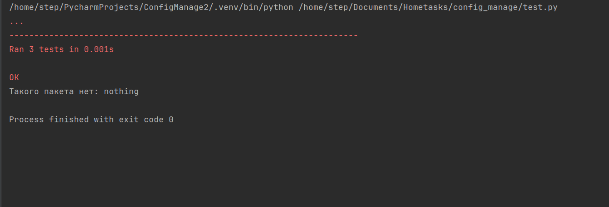

# Анализатор зависимостей
## Задание
Разработать инструмент командной строки для визуализации графа
зависимостей, включая транзитивные зависимости. Сторонние программы или
библиотеки для получения зависимостей использовать нельзя.

Зависимости определяются для файла-пакета языка Python (pip). Для
описания графа зависимостей используется представление PlantUML.
Визуализатор должен выводить результат на экран в виде графического
изображения графа.

Ключами командной строки задаются:  
• Путь к программе для визуализации графов.  
• Путь к анализируемому пакету.  
• URL-адрес репозитория.

Все функции визуализатора зависимостей должны быть покрыты тестами.

## Реализация
Программа была реализована на языке python с использованием встроенных модулей 
importlib, importlib.util и importlib.metadata, а также модуля plantuml.

## Тесты
Тесты реализованы с помощью модуля unittest. 
Проект содержит модуль test, в котором находятся тесты различных функций программы. 
Программа запускает функцию с исходным набором данных, а затем сравнивает полученные данные с ожидаемыми.
### Результаты тестов

